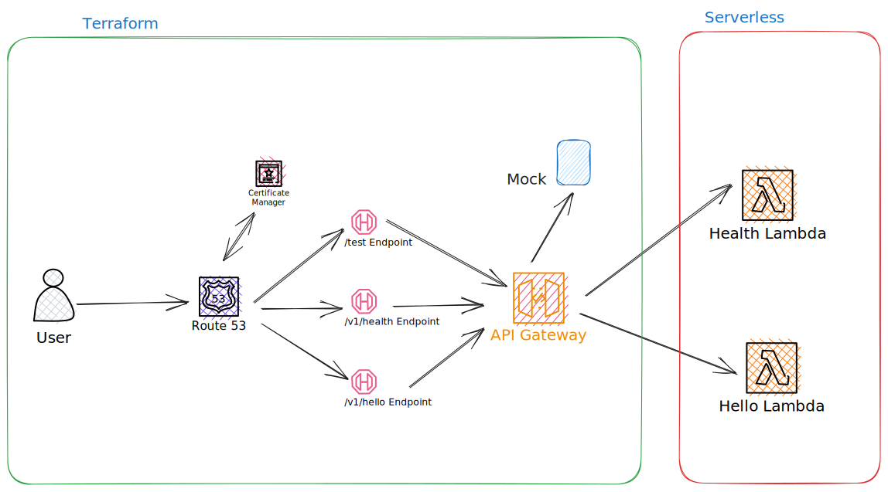

Chaos Testing Example
========================
Chaos testing is a way of measuring the resiliency of an application by simulating failures in a given environment. 
It is to identify any potential unplanned downtimes before it actually happens in reality.

AWS provides Fault Injection Simulator (FIS) to measure an application's readiness. However, AWS FIS currently supports 
managed services like [Amazon Elastic Compute Cloud (Amazon EC2)](https://aws.amazon.com/ec2/), 
[Amazon Elastic Container Service (Amazon ECS)](https://aws.amazon.com/ecs/), 
[Amazon Elastic Kubernetes Service (EKS)]()https://aws.amazon.com/eks/, and 
[Amazon Relational Database Service (RDS)](https://aws.amazon.com/rds/), etc. 
You're out of luck if you use any AWS-managed services like API Gateway, Lambda, etc. This is where 
[LocalStack](https://localstack.cloud/) comes to our rescue.

LocalStack simulates the AWS cloud environment in a single Docker container. You can deploy most of the AWS services, 
including managed services, in a LocalStack Docker container. Once your application is deployed, you can simulate 
multiple failure scenarios by failing a whole service or a service operation in an AWS region. In this sample 
application, we'll be using the LocalStack Pro version since the pro version support most of the managed serverless 
AWS services like API Gateway, Lambda, etc.

Here we're going to experiment with an actual sample application by deploying in a LocalStack container and 
then running multiple chaos test scenarios to measure the sample application's resiliency.

## Sample Application
This sample application consists of an [Amazon API Gateway](https://aws.amazon.com/api-gateway/) which
acts as an entry point to a REST API. This REST API has the following endpoints:
  - a mock `/test` endpoint, i.e., the endpoint generates API responses from the API Gateway directly (mock integration)
  - a `/v1/health` endpoint integrated with an [AWS Lambda](https://aws.amazon.com/lambda/)
  - a `/v1/hello` endpoint integrated with another AWS lambda function

The sample application also has a custom domain (`chaos-example.demo.com`) for easier access to the REST endpoints.

The API Gateway along with the mock integration, custom domain, and ACM certificate is created 
using [Terraform](https://www.terraform.io/) infrastructure code. While both the lambdas along with their 
integrations with the aforementioned API Gateway are managed by the [Serverless framework]((https://www.serverless.com/).



## Prerequisites
Please ensure your computer is ready before you can start playing around with the sample applications. The following tools need 
to be installed on your computer:

- Node.js and NPM
- yarn
- Terraform
- Serverless
- jq
- docker
- python
- pip
- localstack
- awscli-local
- terraform-local

> **Note**
> We'll be using Pro version of LocalStack

## Deploy Sample Application in LocalStack

### Build Application
Once you have checked out the sample application from the GitHub repository, please make sure you can build the 
application by executing the following command:

```
yarn install
```

If everything goes well, the project should successfully download all dependencies.

### Local Stack API Key
Before deploying the sample application in LocalStack, please ensure you have a LocalStack API key since we'll be using 
the Pro version. Once you have the API Key, export the API key as LocalStack expects the key to be present in the 
environment variable `LOCALSTACK_API_KEY`.

```
export LOCALSTACK_API_KEY=<YOUR_API_KEY>
```

### Start LocalStack
We'll be managing LocalStack manually by using Docker Compose. You can run the container by executing the following command:

```
docker-compose up
```

If the Docker container starts up successfully, you should be expecting similar messages shown below:

```
localstack_main  | 2023-06-23T00:28:44.974  INFO --- [-functhread6] hypercorn.error            : Running on https://0.0.0.0:443 (CTRL + C to quit)
localstack_main  | 2023-06-23T00:28:44.974  INFO --- [-functhread6] hypercorn.error            : Running on https://0.0.0.0:443 (CTRL + C to quit)
localstack_main  | 2023-06-23T00:28:44.974  INFO --- [-functhread3] hypercorn.error            : Running on https://0.0.0.0:4566 (CTRL + C to quit)
localstack_main  | 2023-06-23T00:28:44.974  INFO --- [-functhread3] hypercorn.error            : Running on https://0.0.0.0:4566 (CTRL + C to quit)
localstack_main  | 2023-06-23T00:28:45.095  INFO --- [  MainThread] localstack.utils.bootstrap : Execution of "start_runtime_components" took 1206.09ms
localstack_main  | Ready.
```
